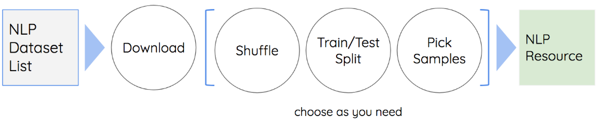
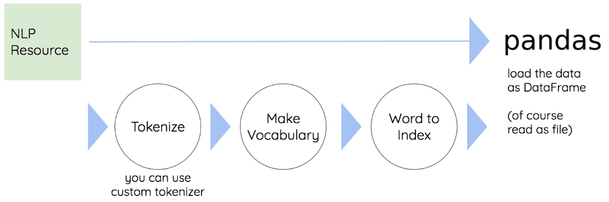
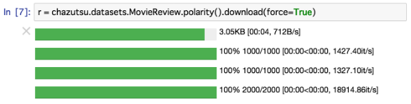

# chazutsu

  
*[photo from Kaikado, traditional Japanese chazutsu maker](http://www.kaikado.jp/english/goods/design.html)*

chazutsu is the dataset downloader for NLP.

```py
>>> import chazutsu
>>> r = chazutsu.datasets.IMDB().download()
>>> r.train_data().head(5)
```
Then

```
   polarity  rating                                             review
0         0       3  You'd think the first landing on the Moon woul...
1         1       9  I took a flyer in renting this movie but I got...
2         1      10  Sometimes I just want to laugh. Don't you? No ...
3         0       2  I knew it wasn't gunna work out between me and...
4         0       2  Sometimes I rest my head and think about the r...
```

You can use chazutsu on Jupyter.

## Install

```
pip install chazutsu
```

## Supported datasetd

chazutsu supports various kinds of datasets!  
**[Please see the details here!](https://github.com/chakki-works/chazutsu/tree/master/chazutsu)**

* Sentiment Analysis
  * Movie Review Data
  * Customer Review Datasets
  * Large Movie Review Dataset(IMDB)
* Text classification
  * 20 Newsgroups
  * Reuters News Courpus (RCV1-v2)
* Language Modeling
  * Penn Tree Bank
  * WikiText-2
  * WikiText-103
  * text8
* Text Summarization
  * DUC2003
  * DUC2004
  * Gigaword
* Textual entailment
  * The Multi-Genre Natural Language Inference (MultiNLI)
* Question Answering
  * The Stanford Question Answering Dataset (SQuAD)


# How it works

chazutsu not only download the dataset, but execute expand archive file, shuffle, split, picking samples process also (You can disable the process by arguments if you don't need).



```
r = chazutsu.datasets.MovieReview.polarity(shuffle=False, test_size=0.3, sample_count=100).download()
```

* `shuffle`: The flag argument for executing shuffle or not(True/False).
* `test_size`: The ratio of the test dataset (If dataset already prepares train and test dataset, this value is ignored).
* `sample_count`: You can pick some samples from the dataset to avoid the editor freeze caused by the heavy text file.
* `force`: Don't use cache, re-download the dataset.

chazutsu supports fundamental process for tokenization.



```py
>>> import chazutsu
>>> r = chazutsu.datasets.MovieReview.subjectivity().download()
>>> r.train_data().head(3)
```

Then

```
    subjectivity                                             review
0             0  . . . works on some levels and is certainly wo...
1             1  the hulk is an anger fueled monster with incre...
2             1  when the skittish emma finds blood on her pill...
```

Now we want to convert this data to train various frameworks.

```py
fixed_len = 10
r.make_vocab(vocab_size=1000)
r.column("review").as_word_seq(fixed_len=fixed_len)
X, y = r.to_batch("train")
assert X.shape == (len(y), fixed_len, len(r.vocab))
assert y.shape == (len(y), 1)
```

* `make_vocab`
  * `vocab_resources`: resources to make vocabulary ("train", "valid", "test")
  * `columns_for_vocab`: The columns to make vocabulary
  * `tokenizer`: Tokenizer
  * `vocab_size`: Vocacbulary size
  * `min_word_freq`: Minimum word count to include the vocabulary
  * `unknown`: The tag used for out of vocabulary word
  * `padding`: The tag used to pad the sequence
  * `end_of_sentence`: If you want to clarify the end-of-line by specific tag, then use this.
  * `reserved_words`: The word that should included in vocabulary (ex. tag for padding)
  * `force`: Don't use cache, re-create the dataset.

If you don't want to load all the training data? You can use `to_batch_iter`.

## Additional Feature

### Use on Jupyter

You can use chazutsu on [Jupyter Notebook](http://jupyter.org/).  



Before you execute chazutsu on Jupyter, you have to enable widget extention by below command.

```
jupyter nbextension enable --py --sys-prefix widgetsnbextension
```
