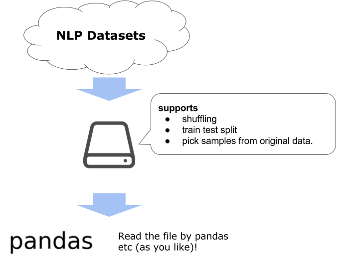

# chazutsu

Do you have trouble with gathering the data for natural language processing?  
For example, exploring the kinds of data, finding where to download, handling huge size and parsing its data (and more!).

**chazutsu** helps you to fighting above problems.


*[photo from Kaikado, traditional Japanese chazutsu maker](http://www.kaikado.jp/english/goods/design.html)*

## Install

```
pip install chazutsu
```

## How to use

**chazutsu** supports you from data download to making file that can be read by [pandas](http://pandas.pydata.org/) etc.



### Download the Datasets

You can download the datasets by chazutsu like following.

```py
>>>import chazutsu
>>>chazutsu.datasets.MovieReview.polarity().show()
About Moview Review Data
movie review data that is annotated by 3 kinds of label (polarity, subjective rating, subjectivity).
see also: http://www.cs.cornell.edu/people/pabo/movie-review-data/
>>>chazutsu.datasets.MovieReview.polarity().download()
Make directory for downloading the file to /your/current/directory
Begin downloading the Moview Review Data dataset from http://www.cs.cornell.edu/people/pabo/movie-review-data/review_polarity.tar.gz.
The dataset file is saved to /your/current/directory/data/moview_review_data/review_polarity.tar.gz
...
Done all process! Make below files at /your/current/directory/data/moview_review_data
 review_polarity_test.txt
 review_polarity_train.txt
```

**Not only the downloading the file, expand & format it. So the prepared files are ready to use!**

The list of datasets is described in [`datasets/README.md`](https://github.com/chakki-works/chazutsu/tree/master/chazutsu/datasets).


### Split to train/test files

You can split the data for training and test.  

```py
>>>import chazutsu
>>>chazutsu.datasets.MovieReview.polarity().download(test_size=0.3)
...
File is splited to review_polarity_train.txt & review_polarity_test.txt. Each records are 1400 & 600 (test_size=30.00%).
...
```

### Make sample file

You don't want to load the all dataset to watch the some lines of data!

If you direct the `sample_count`, you can get the file that is sampled from dataset.

```py
>>>import chazutsu
>>>chazutsu.datasets.MovieReview.polarity().download(sample_count=100)
...
Make review_polarity_samples.txt by picking 100 records from original file.
...
```

